# envlab513 — Build26-LAB513 self-host

Self-hosted setup for **LAB513 — Build an AI app with Azure SQL Hyperscale, Microsoft Fabric, and Microsoft Foundry** on your own Azure subscription. This repo provisions the lab, loads the FAQ data, stages the local lab files, and verifies Exercise-00 readiness.

Reference: [microsoft/Build26-LAB513 · exercise-00.md](https://github.com/microsoft/Build26-LAB513-build-an-ai-app-with-azure-sql-hyperscale-microsoft-fabric-foundry/blob/main/docs/Lab/Instructions/exercise-00.md)

## Layout

| Path | Purpose |
|---|---|
| `scripts/deploy.sh` | Provision RG, VNet, SQL Hyperscale, AI Foundry + models + `FAQ-Assistant-project`, Fabric |
| `scripts/teardown.sh` | Delete RG + purge AI account + clean local secrets |
| `scripts/install-tools.ps1` | VM bootstrap: VS Code, Azure CLI, Git, Python 3.12, devtunnel |
| `scripts/create-vm.ps1` | Create lab VM and run `install-tools.ps1` |
| `sql/01..04_*.sql` | FAQ schema, seed, embeddings, `dbo.SearchFAQ` |
| `sql/05_external_model.sql` | EXTERNAL MODEL for `AI_GENERATE_EMBEDDINGS` (Exercise 2) — token/MI |
| `sql/06_rag_chat.sql` | Exercise 3 (RAG): grounded prompt → GPT-4o — **token/MI, run manually** |
| `labfiles/sql_mcp_server/` | MCP server (`server.py`, `requirements.txt`) → staged to `C:\LabFiles` |
| `labfiles/sql-mcp-lab/` | DAB config + VS Code MCP wiring → staged to `C:\LabFiles` |
| `REPORT.md` | Honest as-built report (regions, security, cost) |

## Prerequisites

Before you run anything, make sure the host (lab VM or your machine) has:

| Requirement | How to get / verify | Why |
|---|---|---|
| **Git on PowerShell** | Install from [git-scm.com](https://git-scm.com/download/win), then in PowerShell run `git --version`. If not found, add it to PATH for the session: `$env:Path += ';C:\Program Files\Git\cmd'` | Clone this repo and commit lab work |
| **Azure CLI + device-code login** | Install Azure CLI, then sign in with **device code** (no browser popup needed): `az login --use-device-code` — open the shown URL, enter the code, pick the account `bibrani@MngEnvMCAP708029.onmicrosoft.com` | `deploy.sh` / `teardown.sh` provision Azure resources |
| **Azure subscription with Contributor** | `az account set --subscription "ME-MngEnvMCAP708029-benyibrani-1"` then `az account show` | Create RG, SQL, AI Foundry, Fabric |
| **GitHub Enterprise + Copilot** | A GitHub account enrolled in your org's **GitHub Enterprise** with **Copilot** enabled; sign in inside VS Code (Accounts → Sign in) | Exercise 2 uses GitHub Copilot to write the semantic-search query |
| **VS Code + extensions** | VS Code with the **GitHub Copilot**, **SQL Server (mssql)**, and **Azure** extensions | Authoring + running SQL / Copilot prompts |

> Device-code tip: if `az login` can't open a browser on the VM, always use `az login --use-device-code` and complete the code on any machine.

## What gets installed / provisioned

**Installed on the lab VM** by `scripts/install-tools.ps1` (via `create-vm.ps1`):

| Tool | Version target | Purpose |
|---|---|---|
| Visual Studio Code | latest | Editor + Copilot + MCP |
| Azure CLI | latest | Provision + manage Azure |
| Git | latest | Clone repo, commit work |
| Python | 3.12 | MCP server (`server.py`) |
| devtunnel | latest | Expose local MCP endpoint (Exercise 4) |
| .NET SDK | latest | DAB (Data API Builder) |

**Provisioned in Azure** by `scripts/deploy.sh`:

| Service | SKU / detail | Region |
|---|---|---|
| Resource group + VNet / Subnet / NSG | lab networking | `indonesiacentral` |
| Azure SQL logical server + **Hyperscale** DB | Serverless, Gen5 2 vCore, system-assigned Managed Identity | `indonesiacentral` |
| **Azure AI Foundry** + `gpt-4o` + `text-embedding-3-small` + `FAQ-Assistant-project` | token-only auth (`disableLocalAuth=true`) | `southeastasia`/`eastus2` (Azure OpenAI not in Indonesia Central) |
| Microsoft Fabric capacity | F2 (skippable with `--no-fabric`) | `indonesiacentral` (fallback `southeastasia`) |

> Cost note: the **Fabric F2 capacity bills continuously** — run `deploy.sh --no-fabric` or `teardown.sh` when not using Exercise 5.

## Quick start on the lab VM

```powershell
# refresh PATH if Git was just installed
$env:Path += ';C:\Program Files\Git\cmd'

git clone https://github.com/ibranibeny/envlab513.git C:\Lab\envlab513
New-Item -ItemType Directory -Force C:\LabFiles | Out-Null
Copy-Item C:\Lab\envlab513\labfiles\* C:\LabFiles\ -Recurse -Force
```

Lab files must live at the paths Exercise-00 checks: `C:\LabFiles\sql_mcp_server` and `C:\LabFiles\sql-mcp-lab`.

## Provision (deploy.sh)

```bash
./scripts/deploy.sh --instance <LAB_INSTANCE_ID> --ai-location eastus2
./scripts/teardown.sh   # when finished — controls cost
```

## Exercise-00 readiness

| Item | Status |
|---|---|
| VS Code + SQL / Copilot extensions | ✅ |
| `python`, `pip`, `dotnet`, `devtunnel` | ✅ |
| `C:\LabFiles\sql_mcp_server` (`server.py`, `requirements.txt`) | ✅ |
| Azure SQL Hyperscale + FAQ tables + `dbo.SearchFAQ` | ✅ |
| Microsoft Foundry `FAQ-Assistant-project` | ✅ |
| Microsoft Fabric workspace | manual (Exercise 5) |

> Secrets are never committed: `.env`, `.vm-cred`, and SQL-password diagnostic scripts are gitignored.

## Exercise 2 & 3 — token auth instead of api-key (workshop note)

This environment's AI account has **local (key) auth disabled** (`disableLocalAuth=true`), so every official lab step that uses an **api-key** must be changed to a **token (Managed Identity)** call. The audience should know the difference:

| Lab step | Official (api-key) | This repo (token / Managed Identity) |
|---|---|---|
| Embeddings / `AI_GENERATE_EMBEDDINGS` | api-key in DSC `SECRET` | DSC `IDENTITY='Managed Identity', SECRET='{"resourceid":"https://cognitiveservices.azure.com"}'` + `CREATE EXTERNAL MODEL` — `sql/05_external_model.sql` |
| Exercise 3 RAG → GPT-4o | `@headers = N'{"api-key":"<KEY>"}'` | `@credential = [https://<ai-account>.cognitiveservices.azure.com]` (no key) — `sql/06_rag_chat.sql` |

**Exercise 3 (RAG) — run manually** in the mssql extension or portal Query editor. The key change in the `sp_invoke_external_rest_endpoint` call:

```sql
EXEC sp_invoke_external_rest_endpoint
    @method     = 'POST',
    @url        = N'https://<ai-account>.cognitiveservices.azure.com/openai/deployments/gpt-4o/chat/completions?api-version=2024-10-21',
    @headers    = N'{"Content-Type":"application/json"}',   -- NO api-key here
    @credential = [https://<ai-account>.cognitiveservices.azure.com],  -- TOKEN (Managed Identity)
    @payload    = @payload,
    @response   = @response OUTPUT;
```

Full script (Task 1 + Task 2) is in `sql/06_rag_chat.sql`; `deploy.sh` renders a ready-to-run copy to `.generated/06_rag_chat.sql` with your account URL filled in.

### Before → after (the exact official snippet)

The official lab Task 2 snippet (api-key, empty `@url`):

```sql
DECLARE @headers NVARCHAR(MAX) = N'{"api-key": ""}';
EXEC sp_invoke_external_rest_endpoint
    @method  = 'POST',
    @url     = N'',
    @headers = @headers,
    @payload = @payload,
    @response = @response OUTPUT;
```

Becomes this **token** version — concrete values for the **current deployment** (`aif-lab513-2139d8`):

```sql
DECLARE @headers NVARCHAR(MAX) = N'{"Content-Type":"application/json"}';   -- no api-key
EXEC sp_invoke_external_rest_endpoint
    @method     = 'POST',
    @url        = N'https://aif-lab513-2139d8.cognitiveservices.azure.com/openai/deployments/gpt-4o/chat/completions?api-version=2024-10-21',
    @headers    = @headers,
    @credential = [https://aif-lab513-2139d8.cognitiveservices.azure.com],   -- TOKEN (Managed Identity)
    @payload    = @payload,
    @response   = @response OUTPUT;
```

> Replace `aif-lab513-2139d8` with your own AI account name if you redeploy — the
> credential name must equal the account URL **without** a trailing slash, and it
> must already exist as a Managed-Identity DATABASE SCOPED CREDENTIAL (created by
> `03_generate_embeddings.sql`).

Prerequisites (created by the SQL bootstrap): `dbo.SearchFAQ`, the master key, the Managed-Identity **DATABASE SCOPED CREDENTIAL**, and the **Cognitive Services OpenAI User** role on the SQL server's managed identity.

### Complete runnable script — Exercise 3 Task 2 (token auth)

Run the **whole** block in one execution (Task 1 builds `@prompt`, Task 2 uses it). In the mssql extension, click in the editor with **no selection** and press **Ctrl+Shift+E** (or **Ctrl+A** then Run) — do **not** run only the Task 2 part or you get `Msg 137: Must declare the scalar variable "@prompt"`. Do **not** add `GO` between the tasks.

```sql
DECLARE @user_question NVARCHAR(1000) = N'My product arrived damaged';
DECLARE @context NVARCHAR(MAX);
DECLARE @prompt NVARCHAR(MAX);

CREATE TABLE #searchResults (
    faq_id INT,
    category NVARCHAR(200),
    question NVARCHAR(MAX),
    answer NVARCHAR(MAX)
);

INSERT INTO #searchResults (faq_id, category, question, answer)
EXEC dbo.SearchFAQ @user_question = @user_question;

SELECT @context =
(
    SELECT STRING_AGG(
        CONCAT(
            'Question: ', question, CHAR(10),
            'Answer: ', answer
        ),
        CHAR(10) + CHAR(10)
    )
    FROM #searchResults
);

SET @prompt =
N'Use ONLY the context below to answer the question.
Context:
' + ISNULL(@context, N'No relevant FAQ context found.') + N'
Question:
' + @user_question + N'
If the answer is not in the context, say you do not know.';

SELECT @prompt AS grounded_prompt;

DROP TABLE #searchResults;

DECLARE @payload  NVARCHAR(MAX);
DECLARE @response NVARCHAR(MAX);
-- TIDAK ada api-key lagi; token diambil dari @credential di bawah
DECLARE @headers  NVARCHAR(MAX) = N'{"Content-Type":"application/json"}';

SET @payload = N'{' +
N'"messages":[' +
N'{"role":"system","content":"You are a helpful assistant that answers questions by using only approved FAQ context."},' +
N'{"role":"user","content":"' + STRING_ESCAPE(@prompt, 'json') + N'"}' +
N'],' +
N'"temperature":0' +
N'}';

EXEC sp_invoke_external_rest_endpoint
    @method     = 'POST',
    @url        = N'https://aif-lab513-2139d8.cognitiveservices.azure.com/openai/deployments/gpt-4o/chat/completions?api-version=2024-10-21',
    @headers    = @headers,
    @credential = [https://aif-lab513-2139d8.cognitiveservices.azure.com],   -- TOKEN, bukan api-key
    @payload    = @payload,
    @response   = @response OUTPUT;

SELECT
    @response AS raw_response,
    COALESCE(
        JSON_VALUE(@response, '$.result.choices[0].message.content'),
        JSON_VALUE(@response, '$.choices[0].message.content'),
        JSON_VALUE(@response, '$.output[0].content[0].text'),
        @response
    ) AS ai_answer;
```

Try other questions by changing `@user_question` — e.g. `N'How do I track my order?'` or `N'Can I pay using cryptocurrency?'` (the latter should answer *I do not know*, demonstrating RAG grounding).

## Exercise 4 — Orchestrate with a Foundry Agent + local MCP server

> **Status: ✅ verified end-to-end.** Foundry agent → dev tunnel → local MCP server (`/mcp`) → `dbo.SearchFAQ` on Azure SQL Hyperscale → grounded answer. The agent invokes the `search_faq` tool and answers from FAQ content (e.g. *"My product arrived damaged"* → *"How do I return a damaged item?"*).

Exercise 4 doesn't add SQL. It runs a **local MCP server** (`labfiles/sql_mcp_server/server.py`) that wraps `dbo.SearchFAQ`, then lets a **Microsoft Foundry agent** call it as a tool. Because the agent runs in Azure but the MCP server runs on your VM (`http://0.0.0.0:8000/mcp`), you need a way for the cloud agent to reach a *local* endpoint — that's what **dev tunnel** does.

### What is `devtunnel`?

`devtunnel` (Microsoft Dev Tunnels) creates a **secure public HTTPS URL** that forwards traffic to a port on your local machine. No firewall change, no public IP, no inbound NSG rule — the tunnel makes an **outbound** connection to the Dev Tunnels service, which then relays requests back to your `localhost:8000`.

| Without devtunnel | With devtunnel |
|---|---|
| Foundry (cloud) cannot reach `http://0.0.0.0:8000` on your VM | Foundry calls `https://<name>.devtunnels.ms` → relayed to your local `:8000` |
| Would need a public IP + open inbound port 8000 (insecure) | Outbound-only, HTTPS, optional auth |

Commands (Exercise 4, Task 2):

```powershell
devtunnel user login
devtunnel create my-faq-tunnel<LAB_INSTANCE_ID> --allow-anonymous
devtunnel port create my-faq-tunnel<LAB_INSTANCE_ID> -p 8000 --protocol http
devtunnel host my-faq-tunnel<LAB_INSTANCE_ID>
```

Copy the printed URL and **append `/mcp`** — paste it into Foundry as the **Remote MCP Server endpoint** (Authentication = *Unauthenticated*, matching `--allow-anonymous`):

```
https://<name>-8000.<region>.devtunnels.ms/mcp
```

Without `/mcp`, Foundry enumerates tools against the root path and fails with **HTTP 404 (Not Found)**.

> **Use the `/mcp` path — the MCP endpoint is not the root URL.** `devtunnel host` prints two forms; prefer the clean subdomain form and append `/mcp`:
>
> ```
> https://<name>-8000.<region>.devtunnels.ms/mcp
> ```
>
> **Opening the tunnel root in a browser returns `Not Found` — that is normal and actually confirms it works.** `server.py` only serves `/mcp`, so a request to `/` (e.g. `https://<name>.devtunnels.ms:8000`) correctly returns `Not Found`. Getting `Not Found` (an HTTP response) means the tunnel relay reached your running server; a *connection refused / 502* would mean `server.py` is not running. Don't validate `/mcp` from a plain browser either — MCP streamable HTTP needs POST + specific headers, so a browser GET still looks odd (405/406). The real validation is connecting it from Foundry (Task 3).

### Run the MCP server (Task 1) — the missing steps

`.venv\Scripts\Activate.ps1` is **generated** by `python -m venv` (it is not shipped). And `server.py` reads SQL settings from a sibling `.env`, which `deploy.sh` writes to the repo root — so copy it in first:

```powershell
cd C:\LabFiles\sql_mcp_server

# 1) Provide DB connection settings (server.py loads ./.env)
copy C:\LabFiles\.env .env        # or: copy .env.example .env  (then fill SQL_FQDN / SQL_ADMIN / SQL_PASSWORD)

# 2) Create + activate the virtual environment (this is what creates Activate.ps1)
python -m venv .venv
.\.venv\Scripts\Activate.ps1

# 3) Install deps and start the server
pip install -r requirements.txt
python server.py
```

Expected banner (keep this terminal running):

```
[MCP] Starting FAQ SQL Assistant on http://0.0.0.0:8000
[MCP] MCP endpoint : http://0.0.0.0:8000/mcp
```

> Note: this layer (MCP server → SQL) uses **SQL auth** (Uid/Pwd from `.env`), as in the official lab. The token/Managed-Identity auth applies to the **SQL → AI Foundry** calls in Exercises 2 & 3.

### Troubleshooting: `Missing SQL connection settings`

If `python server.py` exits immediately with:

```
Missing SQL connection settings. Copy .env.example to .env and fill in SQL_FQDN / SQL_ADMIN / SQL_PASSWORD (see lab513/.env from deploy.sh).
```

…then `server.py` could not find a `.env` next to it (so `SQL_FQDN` / `SQL_ADMIN` are empty). Create the `.env` in the **same folder** as `server.py`:

```powershell
cd C:\LabFiles\sql_mcp_server

# Option A — copy the one deploy.sh generated (has the real values)
copy C:\Lab\envlab513\.env .env

# Option B — write it manually (replace <LAB_INSTANCE_ID> + password)
@"
SQL_FQDN=faq-ai-assistant-<LAB_INSTANCE_ID>.database.windows.net
SQL_DB=faq-ai-assistant-db
SQL_ADMIN=admin-<LAB_INSTANCE_ID>
SQL_PASSWORD=<your-sql-password>
ODBC_DRIVER=ODBC Driver 18 for SQL Server
"@ | Set-Content -Encoding ascii .env

python server.py
```

The password and FQDN are in the `.env` that `deploy.sh` wrote (repo root, e.g. `C:\Lab\envlab513\.env`). Make sure the `(.venv)` prefix is still in your prompt before running `server.py`.

### Troubleshooting: `No such host is known (11001)` from the agent

If Foundry connects fine (it discovers `search_faq`) but invoking the tool returns:

```
TCP Provider: No such host is known (11001) ... tcp:faq-ai-assistant-<LAB_INSTANCE_ID>.database.windows.net,1433
```

…then your `.env` still contains the literal **`<LAB_INSTANCE_ID>`** placeholder (copied from `.env.example` but not filled in), so the SQL hostname doesn't resolve. Replace the placeholders with your real instance id, then **restart `server.py`** (Ctrl+C, then `python server.py` again — `devtunnel host` can keep running):

```powershell
cd C:\LabFiles\sql_mcp_server
copy C:\Lab\envlab513\.env .env   # safest — already has the real values
python server.py
```

Tip: `Select-String LAB_INSTANCE_ID .env` should return **nothing** — if it prints a line, the placeholder is still there.

### Flow diagram

```mermaid
flowchart LR
    User([User question]):::user --> Agent

    subgraph Cloud["☁️ Azure (Microsoft Foundry)"]
        Agent[faq-orchestrator-agent<br/>GPT-4o]:::agent
    end

    subgraph Tunnel["🔒 Dev Tunnels service"]
        DT[[https://name.devtunnels.ms]]:::tunnel
    end

    subgraph VM["🖥️ Lab VM (localhost:8000)"]
        MCP[MCP server<br/>server.py /mcp]:::mcp
    end

    subgraph DB["🗄️ Azure SQL Hyperscale"]
        Proc[dbo.SearchFAQ<br/>vector search]:::sql
        Foundry2[(AI Foundry<br/>text-embedding-3-small)]:::embed
    end

    Agent -- "1 MCP tool call (HTTPS)" --> DT
    DT -- "2 relay to local :8000" --> MCP
    MCP -- "3 EXEC dbo.SearchFAQ" --> Proc
    Proc -- "embed query (token/MI)" --> Foundry2
    Proc -- "4 top FAQ rows" --> MCP
    MCP -- "5 tool result" --> DT
    DT --> Agent
    Agent -- "6 grounded answer" --> User

    classDef user fill:#0078D4,stroke:#003366,color:#fff;
    classDef agent fill:#8661C5,stroke:#3B2E58,color:#fff;
    classDef tunnel fill:#107C10,stroke:#0B520B,color:#fff;
    classDef mcp fill:#D83B01,stroke:#7A2200,color:#fff;
    classDef sql fill:#005BA1,stroke:#002B4D,color:#fff;
    classDef embed fill:#C19C00,stroke:#6E5900,color:#fff;
```



The agent **decides** when to call the tool, retrieves FAQ rows from SQL, and grounds its answer — if nothing relevant comes back (e.g. *"Can I pay using cryptocurrency?"*) it replies *"I do not know based on the available FAQ content."*
