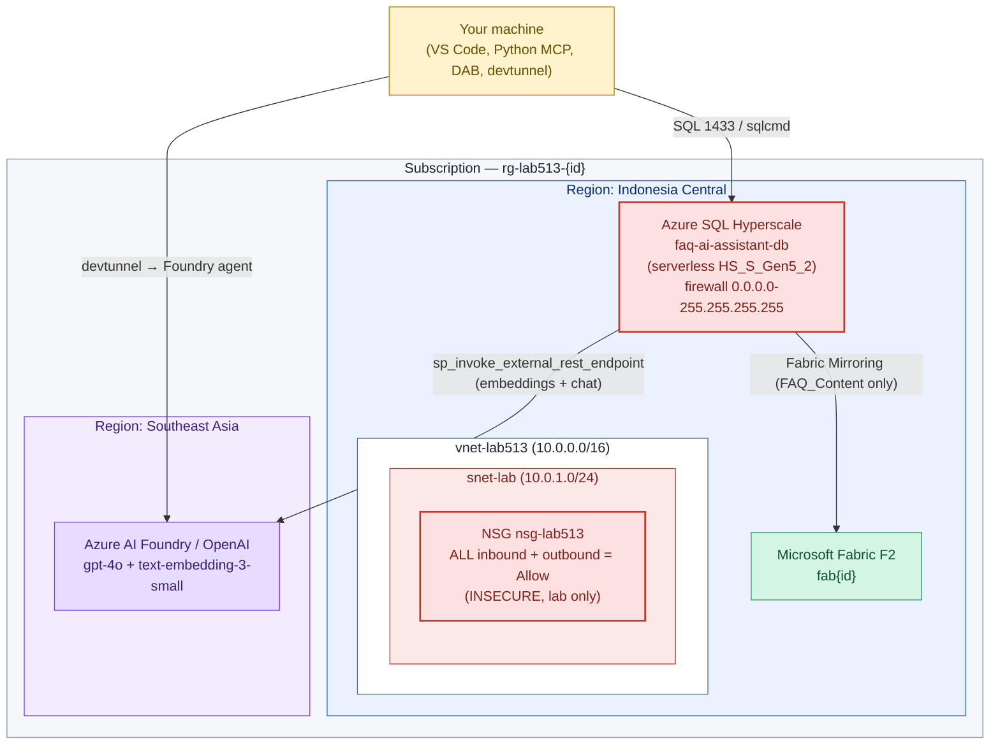
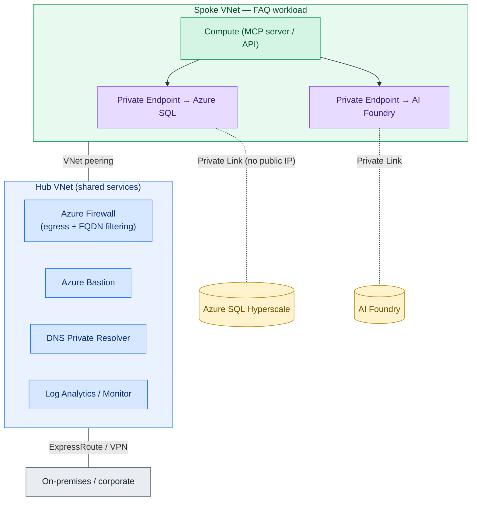

# LAB513 — Deployment Report (self-hosted on your own Azure subscription)

**Lab:** Build an AI app with Azure SQL Hyperscale, Microsoft Fabric, and Microsoft Foundry
**Author of this report:** automated setup for `bibrani@MngEnvMCAP708029.onmicrosoft.com`
**Subscription:** `ME-MngEnvMCAP708029-benyibrani-1` (`439cf6ec-8907-40ee-bae2-7efd9656cd09`)
**Requested primary region:** Indonesia Central (`indonesiacentral`)
**Date:** 2026-06-17

> This report is deliberately **honest**. Where a requested choice is not possible
> (region, licensing) or not secure (open networking), it is called out plainly
> rather than hidden. Nothing here is shoehorned to look better than it is.

---

## 1. TL;DR

- You can run **most** of this lab in **Indonesia Central**, but **not all of it**.
- **Azure OpenAI / Foundry models (`gpt-4o`, `text-embedding-3-small`) are NOT available in Indonesia Central.** The deploy script puts the AI resource in **Southeast Asia** (nearest Azure OpenAI region) and leaves everything else in Indonesia Central.
- The deployment opens **all inbound and outbound NSG rules** and the **SQL firewall to the whole internet** because you explicitly asked for it. **This is insecure and is for a short-lived lab only.** Run `teardown.sh` as soon as you finish.
- **Azure Hybrid Benefit does not apply** here — Azure SQL Database (Hyperscale) is PaaS, not a SQL Server license you bring.
- **Blocker on your machine:** your **WSL distro currently has no network route to Azure** (the Windows host is fine). You must either fix WSL networking or run the script from PowerShell / Azure Cloud Shell. Details in §7.

---

## 2. Region availability — honest mapping

Verified against Microsoft Learn region/product availability (June 2026).

| Component | Deployed region | In Indonesia Central? | Why |
|---|---|---|---|
| Resource group | `indonesiacentral` | ✅ Yes | Region is GA, AZ-enabled (Jakarta) |
| VNet + Subnet + NSG | `indonesiacentral` | ✅ Yes | Networking is available |
| Azure SQL logical server + **Hyperscale** DB | `indonesiacentral` | ✅ Yes | Hyperscale offered in the region |
| **Azure AI Foundry (AIServices) + `gpt-4o` + `text-embedding-3-small`** | **`southeastasia`** | ❌ **No** | Azure OpenAI is **not** offered in Indonesia Central; nearest APAC regions are Southeast Asia, East Asia, Australia East, Japan East, Korea Central, South India |
| Microsoft Fabric capacity (F2) | `indonesiacentral` (fallback `southeastasia`) | ✅ Usually | Fabric capacity is listed for Indonesia Central; script falls back if your tenant/CLI can't create it there |

**Consequence of the split:** Exercise 3 (RAG) and the embeddings step call the AI endpoint in Southeast Asia **from** SQL in Indonesia Central. That cross-region hop adds a small latency (~tens of ms) and a small amount of inter-region egress. For a lab this is negligible; for production you would co-locate or accept the dependency deliberately.

> The script does **not** silently pick a region for you beyond this documented default. It validates `gpt-4o` + `text-embedding-3-small` are deployable in the chosen AI region and warns if not. You can override with `--ai-location <region>`.

---

## 3. What gets deployed (as-built)

Names use a short random `LAB_INSTANCE_ID` (6 hex chars) unless you pass `--instance`.

| Resource | Name pattern | Region | SKU / tier |
|---|---|---|---|
| Resource group | `rg-lab513-{id}` | indonesiacentral | — |
| Virtual network | `vnet-lab513-{id}` (`10.0.0.0/16`) | indonesiacentral | — |
| Subnet | `snet-lab` (`10.0.1.0/24`) | indonesiacentral | — |
| Network security group | `nsg-lab513-{id}` | indonesiacentral | **all in/out = Allow** |
| SQL logical server | `faq-ai-assistant-{id}` | indonesiacentral | — |
| SQL admin login | `admin-{id}` | — | SQL auth |
| SQL database | `faq-ai-assistant-db` | indonesiacentral | **Hyperscale serverless, HS_S_Gen5_2** |
| AI Foundry (Cognitive/AIServices) | `aif-lab513-{id}` | **southeastasia** | S0 |
| ↳ chat deployment | `gpt-4o` (2024-11-20) | southeastasia | GlobalStandard, 20 |
| ↳ embedding deployment | `text-embedding-3-small` (v1) | southeastasia | Standard, 50 |
| Fabric capacity | `fab{id}` | indonesiacentral | **F2** |

Database objects created by the SQL bootstrap (used by Exercises 1–6):
`dbo.FAQ_Content` (14 rows), `dbo.FAQ_Embeddings` (`VECTOR(1536)`), `dbo.SearchFAQ`.

### 3.1 As-built architecture (what the script actually creates)

This is the **real, flat lab network** — one VNet, one subnet, wide-open NSG. It is honest about being a lab, not a reference architecture.



> **Note on the NSG:** in this lab the SQL server, AI Foundry, and Fabric are **PaaS** services reached over their public endpoints — they are not actually placed *inside* the subnet. The VNet/NSG is created because you asked for it and to mirror the lab's networking shape, but the open NSG does **not** by itself secure or expose the PaaS data plane; the **SQL firewall** is what actually controls reach to the database. Both are opened wide here. This is stated plainly so you are not misled into thinking the NSG is protecting the database.

---

## 4. Production recommendation (NOT what the lab deploys)

Per Azure best practice this workload, in production, would be a **spoke peered to a shared-services hub** — never the flat open network above. Including it here only as an honest "what good looks like," **clearly labeled as not part of the lab deployment**.



Production deltas vs. the lab: **Private Endpoints** (no public SQL/AI), **NSG locked to least-privilege**, **Entra ID auth** instead of SQL auth, **Key Vault**-stored secrets / `DATABASE SCOPED CREDENTIAL` instead of an inline API key, and centralized egress/inspection in the hub. None of this is enabled in the lab build because the lab prioritizes speed and you explicitly asked for open networking.

---

## 5. Cost — order-of-magnitude estimate

> ⚠️ **These are rough PAYG retail estimates for planning only, not a quote.** This run had no access to the live Azure Retail Prices API, so **verify current pricing** in the [Azure Pricing Calculator](https://azure.microsoft.com/pricing/calculator/) for **Indonesia Central** and **Southeast Asia** before relying on any number. Currency shown is USD, pay-as-you-go, before any EA/CSP/negotiated discount.

| Component | Billing model | If you tear down same day | If left running ~1 month |
|---|---|---|---|
| SQL Hyperscale **serverless** (HS_S_Gen5_2) | Per vCore-second when active + storage | a few USD | varies a lot with auto-pause/use; tens of USD |
| Azure OpenAI `gpt-4o` | Per 1K input/output tokens | cents (lab volume) | cents–low USD at lab volume |
| Azure OpenAI `text-embedding-3-small` | Per 1K tokens | cents | cents |
| **Microsoft Fabric F2** | **Per-capacity, billed while the capacity exists** (not just when used) | a few USD | **this dominates the bill — pause or delete it** |
| VNet / NSG | No hourly charge for NSG; peering/egress per GB | ~0 | negligible at lab scale |
| Networking egress (cross-region SQL→AI) | Per GB | ~0 | negligible at lab scale |

**Honest cost guidance:**
- The **single biggest cost risk is the Fabric F2 capacity** — it bills continuously while it exists. If you are not actively doing Exercise 5, run `deploy.sh --no-fabric` or **pause/delete** the capacity. A **Fabric Trial** capacity (see TASKS.md) avoids this cost entirely.
- SQL Hyperscale **serverless** auto-pauses when idle, which keeps a forgotten lab cheap — but storage still bills.
- **`teardown.sh` is the cost control.** Same-day teardown keeps the whole lab to a few dollars.

### 5.1 Azure Hybrid Benefit — does it apply? **No.**
AHB lets you reuse on-prem **Windows Server** / **SQL Server** licenses (with Software Assurance) on Azure VMs, SQL MI, or SQL VMs. This lab uses **Azure SQL Database (Hyperscale)**, which is **PaaS** and priced without a bring-your-own-license option for the compute the way AHB defines it. So there is **no AHB saving to claim here**. (You *would* consider AHB if you migrated to SQL Managed Instance or SQL Server on a VM — not the case in this lab.)

---

## 6. Security — what is intentionally insecure

You asked for **all inbound + outbound NSG open** and the deployment also opens the **SQL firewall to the entire internet** so the lab "just works." Being honest about the exposure:

| Control | Lab setting | Risk (OWASP-style) | Production fix |
|---|---|---|---|
| NSG inbound | `Allow * → *` priority 100 | Broad network exposure (A05 Security Misconfiguration) | Least-privilege rules, deny-by-default |
| NSG outbound | `Allow * → *` priority 100 | Unrestricted egress / exfiltration path | Route egress via Azure Firewall, FQDN allow-list |
| SQL firewall | `0.0.0.0 – 255.255.255.255` | **Database reachable from any IP** (A01 Broken Access Control) | Private Endpoint, remove public access |
| SQL auth | SQL login + password in `.env` | Credential handling (A07) | Entra ID auth, managed identity |
| AI key in T-SQL | `api-key` inlined in `sp_invoke_external_rest_endpoint` | Secret in script (A02 Cryptographic/secret handling) | `DATABASE SCOPED CREDENTIAL`, Key Vault |
| Secrets at rest | `.env` (chmod 600) + `.generated/` | Local secret file | Key Vault / no local secrets |

Mitigations actually in place: `.env` is written `chmod 600`; rendered SQL with the key goes to `.generated/` (chmod 600) and is deleted by teardown; data is encrypted in transit (TLS) and at rest by the platform by default. **The real mitigation is time — delete the environment quickly.**

---

## 7. Blocker on your machine: WSL has no route to Azure

During setup, from your **WSL** shell:
- `login.microsoftonline.com` and `management.azure.com` were **unreachable** ("Network is unreachable").
- `az account show` only worked from a **cached token**.
- The **Windows host itself has working internet** — so this is a WSL-only networking problem, not an Azure or account problem.

**You cannot run `deploy.sh` from WSL until this is fixed.** Pick one:

1. **Fix WSL DNS** (quickest):
   ```bash
   echo 'nameserver 1.1.1.1' | sudo tee /etc/resolv.conf
   ```
2. **Enable mirrored networking** — in `C:\Users\benyibrani\.wslconfig`:
   ```ini
   [wsl2]
   networkingMode=mirrored
   ```
   then from PowerShell: `wsl --shutdown`, reopen WSL.
3. **Run from Windows PowerShell** with Azure CLI installed (the scripts are bash; use WSL once fixed, or translate the few `az` calls).
4. **Run from [Azure Cloud Shell](https://shell.azure.com)** — always has connectivity and the CLI preinstalled (upload the `lab513/` folder).

`deploy.sh` and `teardown.sh` both run a **network preflight** and print this same guidance if they can't reach Azure, so you won't get a half-finished deployment.

---

## 8. Files produced

| File | Purpose | Exercise |
|---|---|---|
| `lab513/scripts/deploy.sh` | Provision everything via Azure CLI | all |
| `lab513/scripts/teardown.sh` | Delete RG + purge AI account + clean local secrets | cleanup |
| `lab513/scripts/lib/common.sh` | Shared bash helpers (logging, preflight, validation) | — |
| `lab513/sql/01_schema.sql` | `FAQ_Content` + `FAQ_Embeddings` | 1 |
| `lab513/sql/02_seed_faq.sql` | 14 FAQ rows (Task-6-safe: no "delivery status" row) | 1 |
| `lab513/sql/03_generate_embeddings.sql` | Generate 1,536-dim embeddings from T-SQL | 1 |
| `lab513/sql/04_search_proc.sql` | `dbo.SearchFAQ` (4-column contract) | 1,3,4 |
| `lab513/dab/dab-config.template.json` | DAB reference config | 6 |
| `lab513/labfiles/sql_mcp_server/server.py` | Local MCP server (`search_faq`) — staged to `C:\LabFiles\` | 4 |
| `lab513/labfiles/sql_mcp_server/requirements.txt` | Python deps — staged to `C:\LabFiles\` | 4 |
| `lab513/labfiles/sql-mcp-lab/dab-config.json` | DAB config — staged to `C:\LabFiles\` | 6 |
| `lab513/labfiles/sql-mcp-lab/.vscode/mcp.json` | VS Code MCP wiring — staged to `C:\LabFiles\` | 6 |
| `lab513/TASKS.md` | Step-by-step runbook | all |

---

## 9. What still has to be done in a browser (cannot be scripted)

These are portal/interactive steps the CLI cannot do for you:
- **Exercise 2** — GitHub Copilot sign-in and prompting in VS Code. *(Copilot's semantic-search query verified end-to-end — see §10.2; external model fix committed.)*
- **Exercise 4** — `devtunnel` host + creating the **MCP tool** and **`faq-orchestrator-agent`** in Foundry (`https://ai.azure.com`, project `FAQ-Assistant-project`).
- **Exercise 5** — Fabric workspace `Workspace{id}`, mirrored DB (mirror **only** `dbo.FAQ_Content`), semantic model `FAQ_Content` (Direct Lake on SQL), report `FAQ_rpt`, lineage.

See `TASKS.md` for the exact click-path of each.

---

## 10. Standard lab VM (Indonesia Central) + Exercise-00 simulation — 2026-06-29

Built a standard lab VM directly in **Indonesia Central** via `scripts/create-vm.ps1` (run from WSL through Windows `az` interop, since GSA blocks WSL-native az).

| Property | Value |
|---|---|
| VM | `lab513vm` (Windows Server 2022 Datacenter, `Standard_D2s_v5`) |
| RG / Region | `rg-lab513-vm` / `indonesiacentral` |
| Public IP | `70.153.151.204` |
| FQDN | `lab513vmtcs7g.indonesiacentral.cloudapp.azure.com` |
| RDP (3389) | open via `--nsg-rule RDP` |
| Admin user | `labadmin` (password saved to `lab513/.vm-cred`, **gitignored**) |

**Requirements — all met:**
1. RDP 3389 ✅  2. Public IP ✅  3. VS Code **1.126.0** ✅  4. Azure CLI **2.87.0** ✅ (installed via run-command, file-based to preserve quoting).

**Exercise-00 (environment readiness) simulated on the VM** — VS Code + az CLI verified; sign in later with `az login` using your account. Tools installed by `scripts/install-tools.ps1`.

**GitHub:** environment pushed to **https://github.com/ibranibeny/envlab513** (private). `.vm-cred` excluded by `lab513/.gitignore`.

> Honesty note: `microsoft/Build26-LAB513` exercise-00.md returned 404 (repo private/unavailable), so exercise-00 was simulated as environment setup against the local lab513 toolchain, not fetched verbatim.

### 10.1 Task 6 environment-readiness checks — VERIFIED 2026-06-29

All three Exercise-00 / Task-6 acceptance checks confirmed on `lab513vm` via `az vm run-command`:

| Check | Status | Evidence |
|---|---|---|
| `C:\LabFiles\sql_mcp_server` exists with `requirements.txt` and `server.py` | ✅ | staged via base64 (git unavailable on VM): `srv=True; req=True`; DAB `dab=True; mcp=True` |
| Azure SQL Hyperscale available with FAQ tables and `dbo.SearchFAQ` | ✅ | `dbo.FAQ_Content` (14 rows), `dbo.FAQ_Embeddings`, `dbo.SearchFAQ` confirmed in SSMS |
| Microsoft Foundry opens `FAQ-Assistant-project` | ✅ | project created under `aif-lab513-2139d8` (eastus2) via REST PUT |

> VM tooling status: `dotnet=True`; `git/code/python/pip/devtunnel=False` (LabFiles staged by file-copy, not git clone). `deploy.sh` Foundry project step rewritten to `az rest --body @file` (the `az resource create` form failed).

### 10.2 Exercise 2 (Copilot semantic search) — PASSED 2026-06-29

GitHub Copilot's suggested query for Exercise 2 Task 2 used the modern
`AI_GENERATE_EMBEDDINGS(@q USE MODEL [text-embedding-3-small])` syntax, which
first failed with **Msg 15151 — "Cannot find the external model
'text-embedding-3-small'"** (no external model object existed, and the generated
query referenced a non-existent column `e.Embedding`).

**Fix applied (token / Managed Identity, no api-key):**
- Registered the embedding deployment as a named object via `CREATE EXTERNAL MODEL [text-embedding-3-small]` (`API_FORMAT='Azure OpenAI'`, `MODEL_TYPE=EMBEDDINGS`), reusing the existing Managed-Identity **DATABASE SCOPED CREDENTIAL** from `03_generate_embeddings.sql` — see [sql/05_external_model.sql](sql/05_external_model.sql).
- Corrected the query to the real column name `e.question_embedding`.
- Wired `deploy.sh` to render + apply `05_external_model.sql` immediately after the embeddings step (DSC must exist first).

**Verified on `faq-ai-assistant-db` (real run, not assumed):**

```sql
DECLARE @q  NVARCHAR(MAX) = N'My product arrived damaged';
DECLARE @qv VECTOR(1536)  = AI_GENERATE_EMBEDDINGS(@q USE MODEL [text-embedding-3-small]);
SELECT TOP(3) c.faq_id, c.category, c.question, c.answer
FROM dbo.FAQ_Content c
JOIN dbo.FAQ_Embeddings e ON e.faq_id = c.faq_id
ORDER BY VECTOR_DISTANCE('cosine', @qv, e.question_embedding) ASC;
```

| faq_id | category | question | Status |
|---|---|---|---|
| 5 | Returns | How do I return a damaged item? | ✅ top match |
| 6 | Returns | What if I received the wrong item? | ✅ |
| 7 | Returns | What is your return policy? | ✅ |

`ROWS 3` returned — all three top results are semantically correct (damaged-item / returns).

**Authority:** pattern confirmed against Microsoft Learn (*Use SQL database in AI applications*) — `CREATE EXTERNAL MODEL` + Managed-Identity DSC (`SECRET = '{"resourceid":"https://cognitiveservices.azure.com"}'`) + `AI_GENERATE_EMBEDDINGS` + `VECTOR_DISTANCE` is the official, key-free approach.

**Repo:** committed as `546e267` on `master` (`sql/05_external_model.sql` + `deploy.sh` wiring).

> Note: `faq_id` values (5/6/7) differ from the lab screenshot (2/15/11) only because the seed insert order differs; the matched questions are identical in meaning.
