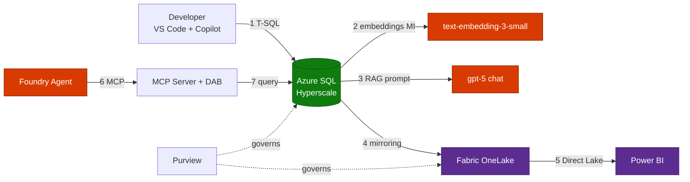

<!-- _class: lead -->

# LAB513
## Build an AI app with Azure SQL Hyperscale, Microsoft Fabric & Microsoft Foundry

**Retrieval-Augmented Generation (RAG) over enterprise FAQ data**

Microsoft Build 2026

---

## Agenda

1. Session overview & learning outcomes
2. Solution architecture
3. Technology stack
4. End-to-end RAG workflow
5. Lab exercises (00–05)
6. Security & governance model
7. Cost profile
8. Key takeaways & next steps

> Speaker notes: ~45-minute hands-on lab. Exercises 00–04 are fully verified; 05 is interactive in the Fabric portal.

---

## Session Overview

Build an **AI-powered FAQ assistant** that answers customer questions using
enterprise data — grounded, governed, and analytics-ready.

- **Azure SQL Hyperscale** vector search over FAQ embeddings
- **Azure OpenAI (gpt-5)** for grounded RAG responses
- **GitHub Copilot** to accelerate T-SQL authoring
- **Microsoft Fabric OneLake** for mirrored analytics
- **Microsoft Purview** for data governance
- **Microsoft Foundry Agents + MCP** for orchestration

> Speaker notes: Emphasize the "grounded" story — RAG reduces hallucinations by retrieving real FAQ context.

---

## Learning Outcomes

By the end of this lab, attendees can:

- Build a **RAG workflow** over enterprise data using Azure SQL vector search + Azure OpenAI
- Mirror operational data into **Microsoft Fabric OneLake** for analytics and downstream AI
- Apply **governance with Microsoft Purview**
- Orchestrate the experience end-to-end with **Microsoft Foundry Agents**

---

## Solution Architecture


> Speaker notes: Export architecture.drawio to SVG first. Three zones — Data (indonesiacentral), AI (eastus2), Analytics (Fabric F2). Token-only auth throughout.

---

## Architecture — Logical View



---

## Technology Stack

| Layer | Service | Role in the lab |
|-------|---------|-----------------|
| Data | **Azure SQL Hyperscale** | Serverless Gen5 2-vCore, vector search |
| AI | **Azure OpenAI (Foundry)** | `gpt-5` + `text-embedding-3-small` |
| Analytics | **Microsoft Fabric** | F2 capacity, OneLake mirroring, Power BI |
| Governance | **Microsoft Purview** | Data catalog & lineage |
| Orchestration | **Microsoft Foundry Agents + MCP** | Tool-calling agent over SQL |
| Productivity | **GitHub Copilot** | Accelerate T-SQL authoring |

---

## End-to-End RAG Workflow

1. **Ingest** — Seed FAQ content into `dbo.FAQ_Content`
2. **Embed** — `AI_GENERATE_EMBEDDINGS` → `dbo.FAQ_Embeddings` (Managed Identity token)
3. **Retrieve** — `dbo.SearchFAQ` ranks nearest vectors for a user question
4. **Augment** — Build a grounded prompt from top FAQ matches
5. **Generate** — Call `gpt-5` for the final grounded answer
6. **Analyze** — Mirror data to OneLake → Power BI trend report
7. **Orchestrate** — Foundry Agent calls the MCP tool over a dev tunnel

> Speaker notes: Steps 1–5 are the core RAG loop; 6–7 extend to analytics and agents.

---

## Lab Exercises

| # | Exercise | Status |
|---|----------|--------|
| 00 | Environment readiness check | ✅ Verified |
| 01 | Schema + embeddings + `SearchFAQ` | ✅ Verified |
| 02 | Copilot semantic-search query | ✅ Verified |
| 03 | RAG grounded prompt → `gpt-5` | ✅ Verified |
| 04 | Foundry agent + local MCP server | ✅ Verified |
| 05 | Microsoft Fabric (OneLake + Power BI) | 🟡 Interactive |

---

## Security & Governance Model

- **Token-only authentication** — AI account has `disableLocalAuth=true`
- **Managed Identity** — SQL → Azure OpenAI via `IDENTITY='Managed Identity'` (no keys)
- **Secrets never committed** — `.env`, `.vm-cred` are gitignored
- **Microsoft Purview** — catalog & lineage across SQL and Fabric
- **Least-privilege RBAC** — scoped role assignments per resource

> Speaker notes: This is a key differentiator vs. the api-key lab flow — everything is keyless.

---

## Cost Profile (Lab Runtime)

| Component | Region | Rate |
|-----------|--------|------|
| VM D2s_v5 (incl. Windows license) | indonesiacentral | $0.200/hr |
| SQL Hyperscale Gen5 (HS_S_Gen5_2) | indonesiacentral | $0.6849/vCore/hr |
| Fabric F2 capacity | indonesiacentral | $0.38/hr |
| gpt-5 / embeddings | eastus2 | per-token |

**Tip:** Run `deploy.sh --no-fabric` or `teardown.sh` to stop Fabric's continuous billing.

> Speaker notes: Interactive cost calculator is published on GitHub Pages.

---

## Deployment Automation

- `scripts/deploy.sh` — provisions RG, VNet, SQL Hyperscale, AI Foundry + models, Fabric
- `scripts/create-vm.ps1` — creates the Windows lab VM + installs tools
- `scripts/teardown.sh` — deletes RG, purges AI account, cleans local secrets
- Idempotent + `--yes` for unattended runs; VM optional via `--with-vm`

```bash
./scripts/deploy.sh --instance <ID> --ai-location eastus2
./scripts/teardown.sh   # when finished — controls cost
```

---

## Key Takeaways

- **Grounded AI** — RAG over SQL vector search reduces hallucinations
- **Keyless by design** — Managed Identity + token auth end-to-end
- **Unified analytics** — Fabric OneLake mirroring, no ETL
- **Agentic** — Foundry Agents + MCP turn SQL into a callable tool
- **Copilot-accelerated** — write T-SQL faster with grounded prompts

---

<!-- _class: lead -->

# Next Steps

**Keep learning:** aka.ms/build26-next-steps

Connect the **Microsoft Learn MCP Server** in VS Code
for the latest official documentation

Thank you!

> Speaker notes: Encourage attendees to try the Copilot prompts in the repo README.
