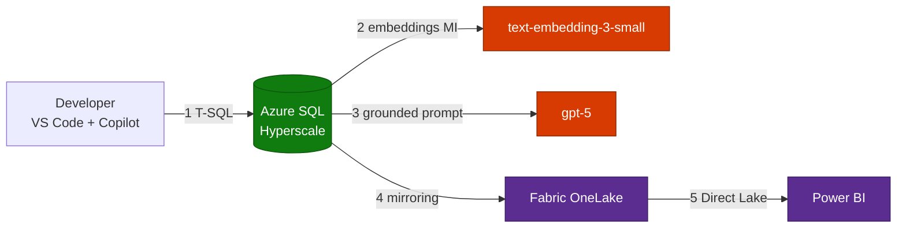

<!-- _class: lead -->

# LAB513
## Build an AI App with Azure SQL Hyperscale, Microsoft Fabric & Microsoft Foundry

**Retrieval-Augmented Generation (RAG) over enterprise FAQ data**

Microsoft Build 2026 · Hands-on Workshop

---

## Agenda

1. **Overview** — what you build & learning outcomes
2. **Architecture** — solution & technology stack
3. **RAG workflow** — end-to-end, step by step
4. **Exercises & security** — the 6 lab exercises + keyless auth
5. **Deploy & cost** — automation and runtime cost
6. **Next steps** — keep learning

> Speaker notes: ~45-minute hands-on lab. Exercises 00–04 verified; 05 is interactive in the Fabric portal.

---

## Overview & Architecture

Build an **AI-powered FAQ assistant** — grounded, governed, analytics-ready.

| Layer | Service | Role |
|-------|---------|------|
| **Data** | Azure SQL Hyperscale | Serverless Gen5 2-vCore, vector search |
| **AI** | Azure OpenAI (Foundry) | `gpt-5` + `text-embedding-3-small` |
| **Analytics** | Microsoft Fabric (F2) | OneLake mirroring + Power BI |
| **Governance** | Microsoft Purview | Catalog & lineage |
| **Orchestration** | Foundry Agents + MCP | SQL as a callable tool |

---

## End-to-End RAG Workflow



**Ingest → Embed → Retrieve → Augment → Generate → Analyze**

---

## Exercises & Security

| # | Exercise | Status |
|---|----------|--------|
| 00–01 | Readiness · Schema + embeddings + `SearchFAQ` | ✅ |
| 02–03 | Copilot semantic search · RAG → `gpt-5` | ✅ |
| 04 | Foundry agent + local MCP server | ✅ |
| 05 | Microsoft Fabric (OneLake + Power BI) | 🟡 Interactive |

**Keyless by design:** `disableLocalAuth=true` — SQL → Azure OpenAI via **Managed Identity**, no keys stored.

---

## Deploy, Cost & Next Steps

- **Automation** — `deploy.sh` provisions SQL, Foundry + models, Fabric; `teardown.sh` controls cost
- **Cost (per hour):** VM $0.200 · SQL Hyperscale $0.6849/vCore · Fabric F2 $0.38 · gpt-5 per-token
- **Tip:** run `deploy.sh --no-fabric` or `teardown.sh` to stop Fabric billing

```bash
./scripts/deploy.sh --instance <ID> --ai-location eastus2
```

**Keep learning:** aka.ms/build26-next-steps · Connect the **Microsoft Learn MCP Server** in VS Code

> Thank you!
